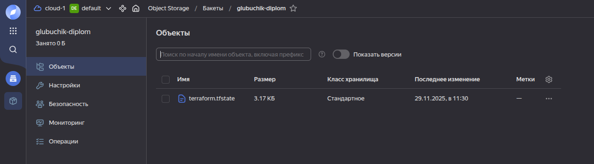

# Дипломный практикум в Yandex.Cloud
  * [Цели:](#цели)
  * [Этапы выполнения:](#этапы-выполнения)
     * [Создание облачной инфраструктуры](#создание-облачной-инфраструктуры)
     * [Создание Kubernetes кластера](#создание-kubernetes-кластера)
     * [Создание тестового приложения](#создание-тестового-приложения)
     * [Подготовка cистемы мониторинга и деплой приложения](#подготовка-cистемы-мониторинга-и-деплой-приложения)
     * [Установка и настройка CI/CD](#установка-и-настройка-cicd)
  * [Что необходимо для сдачи задания?](#что-необходимо-для-сдачи-задания)
  * [Как правильно задавать вопросы дипломному руководителю?](#как-правильно-задавать-вопросы-дипломному-руководителю)

**Перед началом работы над дипломным заданием изучите [Инструкция по экономии облачных ресурсов](https://github.com/netology-code/devops-materials/blob/master/cloudwork.MD).**

---
## Цели:

1. Подготовить облачную инфраструктуру на базе облачного провайдера Яндекс.Облако.
2. Запустить и сконфигурировать Kubernetes кластер.
3. Установить и настроить систему мониторинга.
4. Настроить и автоматизировать сборку тестового приложения с использованием Docker-контейнеров.
5. Настроить CI для автоматической сборки и тестирования.
6. Настроить CD для автоматического развёртывания приложения.

---
## Этапы выполнения:


### Создание облачной инфраструктуры

Для начала необходимо подготовить облачную инфраструктуру в ЯО при помощи [Terraform](https://www.terraform.io/).

Особенности выполнения:

- Бюджет купона ограничен, что следует иметь в виду при проектировании инфраструктуры и использовании ресурсов;
Для облачного k8s используйте региональный мастер(неотказоустойчивый). Для self-hosted k8s минимизируйте ресурсы ВМ и долю ЦПУ. В обоих вариантах используйте прерываемые ВМ для worker nodes.

Предварительная подготовка к установке и запуску Kubernetes кластера.

1. Создайте сервисный аккаунт, который будет в дальнейшем использоваться Terraform для работы с инфраструктурой с необходимыми и достаточными правами. Не стоит использовать права суперпользователя

#### Выполнено в [01-terraform/main.tf](01-terraform/main.tf)
```
# Создание сервисного аккаунта для Terraform
resource "yandex_iam_service_account" "service" {
  folder_id     = var.folder_id
  name          = var.account_name
  description   = "Service account"
}

# Назначение роли сервисному аккаунту
resource "yandex_resourcemanager_folder_iam_member" "service-editor" {
  folder_id = var.folder_id
  role      = "editor"
  member    = "serviceAccount:${yandex_iam_service_account.service.id}"
}

# Создание статического ключа доступа
resource "yandex_iam_service_account_static_access_key" "service-keys" {
  service_account_id = yandex_iam_service_account.service.id
  description        = "Static access keys"
}
```

2. Подготовьте [backend](https://developer.hashicorp.com/terraform/language/backend) для Terraform:  
   а. Рекомендуемый вариант: S3 bucket в созданном ЯО аккаунте(создание бакета через TF)
   б. Альтернативный вариант:  [Terraform Cloud](https://app.terraform.io/)

#### Выполнено в [01-terraform/main.tf](01-terraform/main.tf)
```
# Создание бакета с использованием ключа
resource "yandex_storage_bucket" "tf-bucket" {
  access_key = yandex_iam_service_account_static_access_key.service-keys.access_key
  secret_key = yandex_iam_service_account_static_access_key.service-keys.secret_key
  bucket     = var.bucket_name
  folder_id  = var.folder_id
  anonymous_access_flags {
    read = false
    list = false
  }

  force_destroy = true

provisioner "local-exec" {
  command = "echo 'access_key = \"${yandex_iam_service_account_static_access_key.service-keys.access_key}\"' > ../02-kubernetes/terraform/backend.conf"
}

provisioner "local-exec" {
  command = "echo 'secret_key = \"${yandex_iam_service_account_static_access_key.service-keys.secret_key}\"' >> ../02-kubernetes/terraform/backend.conf"
}
}
```
access_key и secret_key будут записаны в /02-kubernetes/terraform/backend.conf, после чего будут использоваться для подключентия к backend

3. Создайте конфигурацию Terrafrom, используя созданный бакет ранее как бекенд для хранения стейт файла. Конфигурации Terraform для создания сервисного аккаунта и бакета и основной инфраструктуры следует сохранить в разных папках.

#### Выполнено в [02-kubernetes/terraform/providers.tf](02-kubernetes/terraform/providers.tf)
```
terraform {
  backend "s3" {
    endpoints = {
      s3 = "https://storage.yandexcloud.net"
    }
    bucket     = "glubuchik-diplom"
    key        = "terraform.tfstate"
    region     = "ru-central1"

    skip_region_validation      = true
    skip_credentials_validation = true
    skip_requesting_account_id  = true
    skip_s3_checksum            = true
  }
  required_providers {
    yandex = {
      source = "yandex-cloud/yandex"
      version = "0.169"
    }
  }
  required_version = ">1.8.4"
}
```
Для того чтобы подключится к нужно указать backend-config
```
terraform init -backend-config=backend.conf
```
4. Создайте VPC с подсетями в разных зонах доступности.
#### Выполнено в [02-kubernetes/terraform/main.tf](02-kubernetes/terraform/terraform/main.tf)
```
# Создание сети
resource "yandex_vpc_network" "develop" {
  name = var.vpc_name
}

# Создание подсетей в разных зонах
resource "yandex_vpc_subnet" "subnet1" {
  name           = var.vpc_subnet.subnet1.name
  zone           = var.vpc_subnet.subnet1.zone
  network_id     = yandex_vpc_network.develop.id
  v4_cidr_blocks = var.vpc_subnet.subnet1.cidr
}

resource "yandex_vpc_subnet" "subnet2" {
  name           = var.vpc_subnet.subnet2.name
  zone           = var.vpc_subnet.subnet2.zone
  network_id     = yandex_vpc_network.develop.id
  v4_cidr_blocks = var.vpc_subnet.subnet2.cidr
}
```

5. Убедитесь, что теперь вы можете выполнить команды `terraform destroy` и `terraform apply` без дополнительных ручных действий.
```
glubuchik@glubuchik-X15-AT-22:~/обучение/Netology/devops-diplom-yandexcloud-main/02-kubernetes$ terraform apply

Terraform used the selected providers to generate the following execution plan. Resource actions are indicated with the following symbols:
  + create

Terraform will perform the following actions:

  # yandex_vpc_network.develop will be created
  + resource "yandex_vpc_network" "develop" {
      + created_at                = (known after apply)
      + default_security_group_id = (known after apply)
      + folder_id                 = (known after apply)
      + id                        = (known after apply)
      + labels                    = (known after apply)
      + name                      = "develop"
      + subnet_ids                = (known after apply)
    }

  # yandex_vpc_subnet.subnet1 will be created
  + resource "yandex_vpc_subnet" "subnet1" {
      + created_at     = (known after apply)
      + folder_id      = (known after apply)
      + id             = (known after apply)
      + labels         = (known after apply)
      + name           = "subnet1"
      + network_id     = (known after apply)
      + v4_cidr_blocks = [
          + "192.168.10.0/24",
        ]
      + v6_cidr_blocks = (known after apply)
      + zone           = "ru-central1-a"
    }

  # yandex_vpc_subnet.subnet2 will be created
  + resource "yandex_vpc_subnet" "subnet2" {
      + created_at     = (known after apply)
      + folder_id      = (known after apply)
      + id             = (known after apply)
      + labels         = (known after apply)
      + name           = "subnet2"
      + network_id     = (known after apply)
      + v4_cidr_blocks = [
          + "192.168.20.0/24",
        ]
      + v6_cidr_blocks = (known after apply)
      + zone           = "ru-central1-b"
    }

Plan: 3 to add, 0 to change, 0 to destroy.

Do you want to perform these actions?
  Terraform will perform the actions described above.
  Only 'yes' will be accepted to approve.

  Enter a value: yes

yandex_vpc_network.develop: Creating...
yandex_vpc_network.develop: Creation complete after 4s [id=enpq28e14fcadlojgav0]
yandex_vpc_subnet.subnet1: Creating...
yandex_vpc_subnet.subnet2: Creating...
yandex_vpc_subnet.subnet1: Creation complete after 1s [id=e9bsqj557554m1l9vcrf]
yandex_vpc_subnet.subnet2: Creation complete after 1s [id=e2lq5qhokj1kr03dsie3]

Apply complete! Resources: 3 added, 0 changed, 0 destroyed.
```
В s3 создался terraform.tfstate


```
glubuchik@glubuchik-X15-AT-22:~/обучение/Netology/devops-diplom-yandexcloud-main/02-kubernetes$ terraform destroy
yandex_vpc_network.develop: Refreshing state... [id=enpq28e14fcadlojgav0]
yandex_vpc_subnet.subnet2: Refreshing state... [id=e2lq5qhokj1kr03dsie3]
yandex_vpc_subnet.subnet1: Refreshing state... [id=e9bsqj557554m1l9vcrf]

Terraform used the selected providers to generate the following execution plan. Resource actions are indicated with the following symbols:
  - destroy

Terraform will perform the following actions:

  # yandex_vpc_network.develop will be destroyed
  - resource "yandex_vpc_network" "develop" {
      - created_at                = "2025-11-29T08:30:41Z" -> null
      - default_security_group_id = "enpco77rrhc4uth4fe4k" -> null
      - folder_id                 = "b1gliq36v37iol484r5a" -> null
      - id                        = "enpq28e14fcadlojgav0" -> null
      - labels                    = {} -> null
      - name                      = "develop" -> null
      - subnet_ids                = [
          - "e2lq5qhokj1kr03dsie3",
          - "e9bsqj557554m1l9vcrf",
        ] -> null
        # (1 unchanged attribute hidden)
    }

  # yandex_vpc_subnet.subnet1 will be destroyed
  - resource "yandex_vpc_subnet" "subnet1" {
      - created_at     = "2025-11-29T08:30:45Z" -> null
      - folder_id      = "b1gliq36v37iol484r5a" -> null
      - id             = "e9bsqj557554m1l9vcrf" -> null
      - labels         = {} -> null
      - name           = "subnet1" -> null
      - network_id     = "enpq28e14fcadlojgav0" -> null
      - v4_cidr_blocks = [
          - "192.168.10.0/24",
        ] -> null
      - v6_cidr_blocks = [] -> null
      - zone           = "ru-central1-a" -> null
        # (2 unchanged attributes hidden)
    }

  # yandex_vpc_subnet.subnet2 will be destroyed
  - resource "yandex_vpc_subnet" "subnet2" {
      - created_at     = "2025-11-29T08:30:45Z" -> null
      - folder_id      = "b1gliq36v37iol484r5a" -> null
      - id             = "e2lq5qhokj1kr03dsie3" -> null
      - labels         = {} -> null
      - name           = "subnet2" -> null
      - network_id     = "enpq28e14fcadlojgav0" -> null
      - v4_cidr_blocks = [
          - "192.168.20.0/24",
        ] -> null
      - v6_cidr_blocks = [] -> null
      - zone           = "ru-central1-b" -> null
        # (2 unchanged attributes hidden)
    }

Plan: 0 to add, 0 to change, 3 to destroy.

Do you really want to destroy all resources?
  Terraform will destroy all your managed infrastructure, as shown above.
  There is no undo. Only 'yes' will be accepted to confirm.

  Enter a value: yes

yandex_vpc_subnet.subnet2: Destroying... [id=e2lq5qhokj1kr03dsie3]
yandex_vpc_subnet.subnet1: Destroying... [id=e9bsqj557554m1l9vcrf]
yandex_vpc_subnet.subnet1: Destruction complete after 0s
yandex_vpc_subnet.subnet2: Destruction complete after 1s
yandex_vpc_network.develop: Destroying... [id=enpq28e14fcadlojgav0]
yandex_vpc_network.develop: Destruction complete after 1s

Destroy complete! Resources: 3 destroyed.
```

Ожидаемые результаты:

1. Terraform сконфигурирован и создание инфраструктуры посредством Terraform возможно без дополнительных ручных действий, стейт основной конфигурации сохраняется в бакете или Terraform Cloud
2. Полученная конфигурация инфраструктуры является предварительной, поэтому в ходе дальнейшего выполнения задания возможны изменения.

---
### Создание Kubernetes кластера

На этом этапе необходимо создать [Kubernetes](https://kubernetes.io/ru/docs/concepts/overview/what-is-kubernetes/) кластер на базе предварительно созданной инфраструктуры.   Требуется обеспечить доступ к ресурсам из Интернета.

Это можно сделать двумя способами:

1. Рекомендуемый вариант: самостоятельная установка Kubernetes кластера.  
   а. При помощи Terraform подготовить как минимум 3 виртуальных машины Compute Cloud для создания Kubernetes-кластера. Тип виртуальной машины следует выбрать самостоятельно с учётом требовании к производительности и стоимости. Если в дальнейшем поймете, что необходимо сменить тип инстанса, используйте Terraform для внесения изменений.  
   б. Подготовить [ansible](https://www.ansible.com/) конфигурации, можно воспользоваться, например [Kubespray](https://kubernetes.io/docs/setup/production-environment/tools/kubespray/)  
   в. Задеплоить Kubernetes на подготовленные ранее инстансы, в случае нехватки каких-либо ресурсов вы всегда можете создать их при помощи Terraform.

Скачиваю kubespray
```
git clone https://github.com/kubernetes-sigs/kubespray.git
```
Устанавливаю зависимости
```
pip3 install -r requirements.txt
```
Копирую пример
```
cp -rfp inventory/sample inventory/mycluster
```
В ./02-kubernetes/kubespray/inventory/sample/group_vars/k8s_cluster/k8s-cluster.yml прописываю, для формирования файла конфигурации Kubernetes
```
kubeconfig_localhost: true
```
Добавляю в (02-kubernetes/terraform/terraform/main.tf)[02-kubernetes/terraform/terraform/main.tf]
```
# Запуск kubespray для настройки K8S кластера
resource "null_resource" "run_kubespray" {
  depends_on = [
    local_file.ansible_inventory
  ]

  provisioner "local-exec" {
    command = <<-EOT
      cd ${path.module}/../kubespray && \
      ansible-playbook -i inventory/mycluster/hosts.yaml \
        -u ubuntu \
        --become --become-user=root \
        cluster.yml \
        --flush-cache
    EOT
  }
}
```
Экспортируем конфиг и проверяем
```
(kubespray) glubuchik@glubuchik-X15-AT-22:~/обучение/Netology/devops-diplom-yandexcloud/02-kubernetes/terraform$ export KUBECONFIG=~/обучение/Netology/devops-diplom-yandexcloud/02-kubernetes/kubespray/inventory/mycluster/artifacts/admin.conf

(kubespray) glubuchik@glubuchik-X15-AT-22:~/обучение/Netology/devops-diplom-yandexcloud/02-kubernetes/terraform$ kubectl cluster-info
Kubernetes control plane is running at https://158.160.100.14:6443

To further debug and diagnose cluster problems, use 'kubectl cluster-info dump'.
(kubespray) glubuchik@glubuchik-X15-AT-22:~/обучение/Netology/devops-diplom-yandexcloud/02-kubernetes/terraform$ kubectl get nodes
NAME       STATUS   ROLES           AGE   VERSION
master-1   Ready    control-plane   23m   v1.34.2
worker-1   Ready    <none>          22m   v1.34.2
worker-2   Ready    <none>          22m   v1.34.2

(kubespray) glubuchik@glubuchik-X15-AT-22:~/обучение/Netology/devops-diplom-yandexcloud/02-kubernetes/terraform$ kubectl get pods --all-namespaces
NAMESPACE     NAME                                       READY   STATUS    RESTARTS   AGE
kube-system   calico-kube-controllers-568b875685-8hqjf   1/1     Running   0          22m
kube-system   calico-node-qz8s9                          1/1     Running   0          23m
kube-system   calico-node-vfsfc                          1/1     Running   0          23m
kube-system   calico-node-zvfvx                          1/1     Running   0          23m
kube-system   coredns-64b5cc5cbc-lxnx6                   1/1     Running   0          22m
kube-system   coredns-64b5cc5cbc-wxfqt                   1/1     Running   0          22m
kube-system   dns-autoscaler-5594cbb9c4-z8l4j            1/1     Running   0          22m
kube-system   kube-apiserver-master-1                    1/1     Running   1          25m
kube-system   kube-controller-manager-master-1           1/1     Running   2          25m
kube-system   kube-proxy-nqgf9                           1/1     Running   0          24m
kube-system   kube-proxy-nxf5d                           1/1     Running   0          24m
kube-system   kube-proxy-v95j2                           1/1     Running   0          24m
kube-system   kube-scheduler-master-1                    1/1     Running   1          25m
kube-system   nginx-proxy-worker-1                       1/1     Running   0          24m
kube-system   nginx-proxy-worker-2                       1/1     Running   0          24m
kube-system   nodelocaldns-f6sm2                         1/1     Running   0          22m
kube-system   nodelocaldns-rnjvf                         1/1     Running   0          22m
kube-system   nodelocaldns-zvt9f                         1/1     Running   0          22m
```

Ожидаемый результат:

1. Работоспособный Kubernetes кластер.
2. В файле `~/.kube/config` находятся данные для доступа к кластеру.
3. Команда `kubectl get pods --all-namespaces` отрабатывает без ошибок.

---
### Создание тестового приложения

Для перехода к следующему этапу необходимо подготовить тестовое приложение, эмулирующее основное приложение разрабатываемое вашей компанией.

Способ подготовки:

1. Рекомендуемый вариант:  
   а. Создайте отдельный git репозиторий с простым nginx конфигом, который будет отдавать статические данные.  
   б. Подготовьте Dockerfile для создания образа приложения.  
2. Альтернативный вариант:  
   а. Используйте любой другой код, главное, чтобы был самостоятельно создан Dockerfile.

Ожидаемый результат:

1. Git репозиторий с тестовым приложением и Dockerfile.
2. Регистри с собранным docker image. В качестве регистри может быть DockerHub или [Yandex Container Registry](https://cloud.yandex.ru/services/container-registry), созданный также с помощью terraform.

---
### Подготовка cистемы мониторинга и деплой приложения

Уже должны быть готовы конфигурации для автоматического создания облачной инфраструктуры и поднятия Kubernetes кластера.  
Теперь необходимо подготовить конфигурационные файлы для настройки нашего Kubernetes кластера.

Цель:
1. Задеплоить в кластер [prometheus](https://prometheus.io/), [grafana](https://grafana.com/), [alertmanager](https://github.com/prometheus/alertmanager), [экспортер](https://github.com/prometheus/node_exporter) основных метрик Kubernetes.
2. Задеплоить тестовое приложение, например, [nginx](https://www.nginx.com/) сервер отдающий статическую страницу.

Способ выполнения:
1. Воспользоваться пакетом [kube-prometheus](https://github.com/prometheus-operator/kube-prometheus), который уже включает в себя [Kubernetes оператор](https://operatorhub.io/) для [grafana](https://grafana.com/), [prometheus](https://prometheus.io/), [alertmanager](https://github.com/prometheus/alertmanager) и [node_exporter](https://github.com/prometheus/node_exporter). Альтернативный вариант - использовать набор helm чартов от [bitnami](https://github.com/bitnami/charts/tree/main/bitnami).

### Деплой инфраструктуры в terraform pipeline

1. Если на первом этапе вы не воспользовались [Terraform Cloud](https://app.terraform.io/), то задеплойте и настройте в кластере [atlantis](https://www.runatlantis.io/) для отслеживания изменений инфраструктуры. Альтернативный вариант 3 задания: вместо Terraform Cloud или atlantis настройте на автоматический запуск и применение конфигурации terraform из вашего git-репозитория в выбранной вами CI-CD системе при любом комите в main ветку. Предоставьте скриншоты работы пайплайна из CI/CD системы.

Ожидаемый результат:
1. Git репозиторий с конфигурационными файлами для настройки Kubernetes.
2. Http доступ на 80 порту к web интерфейсу grafana.
3. Дашборды в grafana отображающие состояние Kubernetes кластера.
4. Http доступ на 80 порту к тестовому приложению.
5. Atlantis или terraform cloud или ci/cd-terraform
---
### Установка и настройка CI/CD

Осталось настроить ci/cd систему для автоматической сборки docker image и деплоя приложения при изменении кода.

Цель:

1. Автоматическая сборка docker образа при коммите в репозиторий с тестовым приложением.
2. Автоматический деплой нового docker образа.

Можно использовать [teamcity](https://www.jetbrains.com/ru-ru/teamcity/), [jenkins](https://www.jenkins.io/), [GitLab CI](https://about.gitlab.com/stages-devops-lifecycle/continuous-integration/) или GitHub Actions.

Ожидаемый результат:

1. Интерфейс ci/cd сервиса доступен по http.
2. При любом коммите в репозиторие с тестовым приложением происходит сборка и отправка в регистр Docker образа.
3. При создании тега (например, v1.0.0) происходит сборка и отправка с соответствующим label в регистри, а также деплой соответствующего Docker образа в кластер Kubernetes.

---
## Что необходимо для сдачи задания?

1. Репозиторий с конфигурационными файлами Terraform и готовность продемонстрировать создание всех ресурсов с нуля.
2. Пример pull request с комментариями созданными atlantis'ом или снимки экрана из Terraform Cloud или вашего CI-CD-terraform pipeline.
3. Репозиторий с конфигурацией ansible, если был выбран способ создания Kubernetes кластера при помощи ansible.
4. Репозиторий с Dockerfile тестового приложения и ссылка на собранный docker image.
5. Репозиторий с конфигурацией Kubernetes кластера.
6. Ссылка на тестовое приложение и веб интерфейс Grafana с данными доступа.
7. Все репозитории рекомендуется хранить на одном ресурсе (github, gitlab)

